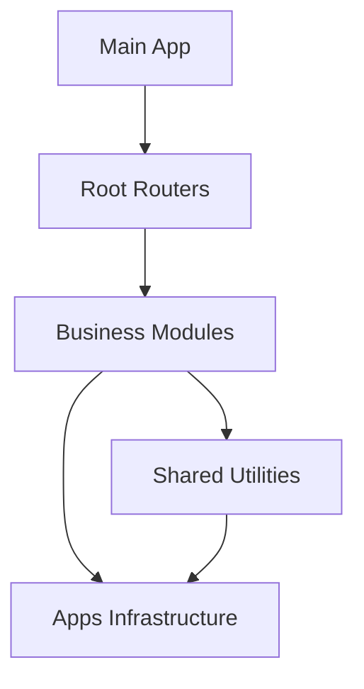

# Screaming Architecture Quick Reference

A cheat sheet for common tasks when working with the screaming architecture pattern.

## 🚀 Quick Commands

### New Project Setup
```bash
# 1. Initialize project
npm init -y

# 2. Install dependencies
npm install hono @hono/zod-validator @trpc/server drizzle-orm drizzle-kit zod jose
npm install -D @types/node @cloudflare/workers-types wrangler typescript vitest

# 3. Create directory structure
mkdir -p src/{apps/{database,integrations,factories,middleware},shared/{interfaces,utils,response-handler}}

# 4. Generate types and start
npm run typegen
npm run dev
```

### New Module Creation
```bash
# Create module directories
mkdir -p src/{module-name}/{entities,use-cases,controllers,routes,validations}
mkdir -p src/apps/database/{schemas,repositories}

# Create files
touch src/{module-name}/entities/{interfaces,entity,index}.ts
touch src/{module-name}/use-cases/{interfaces,service,index}.ts
touch src/{module-name}/controllers/{module}.controller.ts
touch src/{module-name}/routes/{module}.{routes,tRPC-route}.ts
touch src/{module-name}/validations/{module}.validation.ts
touch src/apps/database/schemas/{module}.schema.ts
touch src/apps/database/repositories/{module}.repository.service.ts
```

## 📁 File Structure Reference

```
src/
├── app.ts                    # Main app setup
├── trpc-router.ts           # tRPC routes aggregator
├── rest-router.ts           # REST routes aggregator
├── exports.ts               # Public API exports
├── {business-domain}/       # 🏢 BUSINESS MODULES
├── apps/                    # 🔧 INFRASTRUCTURE
└── shared/                  # 🔄 SHARED UTILITIES
```

## 🏗️ Module Implementation Checklist

### 1. Entity Layer
- [ ] `interfaces.ts` - Define `I{Module}` and `I{Module}Entity`
- [ ] `entity.ts` - Implement entity class with factory
- [ ] `index.ts` - Export entity types and factory

### 2. Use Cases Layer  
- [ ] `interfaces.ts` - Define service and repository interfaces
- [ ] `service.ts` - Implement business logic service
- [ ] `index.ts` - Export service classes

### 3. Database Layer
- [ ] `schemas/{module}.schema.ts` - Drizzle table definition
- [ ] `repositories/{module}.repository.service.ts` - Data access
- [ ] Add to service factory

### 4. API Layer
- [ ] `controllers/{module}.controller.ts` - HTTP handlers (REST only)
- [ ] `routes/{module}.routes.ts` - REST endpoints
- [ ] `routes/{module}.tRPC-route.ts` - tRPC procedures
- [ ] `validations/{module}.validation.ts` - Zod schemas

### 5. Integration
- [ ] Add service to `ServiceFactory`
- [ ] Register REST routes in `rest-router.ts`
- [ ] Register tRPC routes in `trpc-router.ts`
- [ ] Export validations in `exports.ts`

## 🔌 Common Code Patterns

### Entity Factory Pattern
```typescript
export const make{Module}Entity = (deps: IEntityBaseDependencies) => 
  class extends makeBaseEntity(deps) implements I{Module}Entity {
    // Implementation
  };
```

### Service Pattern
```typescript
export class {Module}Service extends BaseService<I{Module}, I{Module}Entity> {
  constructor(protected readonly serviceRepository: I{Module}RepositoryService) {
    super(make{Module}Entity({ generateId: () => crypto.randomUUID() }));
  }
}
```

### Repository Pattern
```typescript
export class {Module}RepositoryService extends BaseRepositoryService<I{Module}> 
  implements I{Module}RepositoryService {
  constructor(db: DB) {
    super(db, {module}Table);
  }
}
```

### tRPC Procedure Pattern
```typescript
export const {module}Router = router({
  create: protectedProcedure
    .input({module}InsertSchema)
    .mutation(async ({ input, ctx }) => {
      const factory = new ServiceFactory(ctx.c);
      const service = factory.make{Module}Service();
      return (await service.create(input)).toObject();
    }),
});
```

### REST Route Pattern
```typescript
export function create{Module}Routes() {
  const app = new Hono();
  app.post("/", zValidator("json", schema), (c) => {
    const controller = new {Module}Controller(c);
    return controller.create(c);
  });
  return app;
}
```

## 🔗 Integration Points

### Add New Module to tRPC Router
```typescript
// src/trpc-router.ts
import { {module}Router } from '@/{module-name}/routes/{module}.tRPC-route';

export const appRouter = router({
  // existing...
  {module}: {module}Router,
});
```

### Add New Module to REST Router
```typescript
// src/rest-router.ts
import { create{Module}Routes } from '@/{module-name}/routes/{module}.routes';

export function createRESTRouter() {
  const app = new Hono();
  // existing...
  app.route('/{modules}', create{Module}Routes());
  return app;
}
```

### Add Service to Factory
```typescript
// src/apps/factories/service.factory.ts
private _{module}Service: {Module}Service | null = null;

make{Module}Service(): {Module}Service {
  if (!this._{module}Service) {
    const repo = new {Module}RepositoryService(this.db);
    this._{module}Service = new {Module}Service(repo);
  }
  return this._{module}Service;
}
```

## 🎯 Path Mapping Reference

```typescript
// Import patterns
import { ServiceFactory } from '@/apps/factories/service.factory';
import { {Module}Service } from '@/{module-name}/use-cases/service';
import { ResponseHandler } from '@/shared/response-handler';
import { BaseService } from '@/shared/utils/services/service';
import { make{Module}Entity } from '@/{module-name}/entities/entity';
```

## 🧪 Testing Patterns

### Entity Test
```typescript
describe('{Module}Entity', () => {
  const EntityClass = make{Module}Entity({ generateId: () => 'test-id' });
  
  it('should create entity with required fields', () => {
    const entity = new EntityClass({ name: 'Test' });
    expect(entity.name).toBe('Test');
    expect(entity.id).toBe('test-id');
  });
});
```

### Service Test
```typescript
describe('{Module}Service', () => {
  const mockRepo = {
    insert: vi.fn(),
    findById: vi.fn(),
  } as any;
  
  const service = new {Module}Service(mockRepo);
  
  it('should create entity', async () => {
    mockRepo.insert.mockResolvedValue({ id: '1', name: 'Test' });
    const result = await service.create({ name: 'Test' });
    expect(result.name).toBe('Test');
  });
});
```

## 🎨 Naming Conventions

### Files
- **Entities**: `{module}.entity.ts`, `{module}.interfaces.ts`
- **Services**: `{module}.service.ts`
- **Controllers**: `{module}.controller.ts`
- **Routes**: `{module}.routes.ts`, `{module}.tRPC-route.ts`
- **Schemas**: `{module}.schema.ts`
- **Validations**: `{module}.validation.ts`

### Classes/Interfaces
- **Entity Interface**: `I{ModuleName}` (e.g., `IUser`)
- **Entity Class**: `{ModuleName}Entity` (e.g., `UserEntity`)
- **Service**: `{ModuleName}Service` (e.g., `UserService`)
- **Repository**: `{ModuleName}RepositoryService` (e.g., `UserRepositoryService`)
- **Controller**: `{ModuleName}Controller` (e.g., `UserController`)

### Functions
- **Entity Factory**: `make{ModuleName}Entity`
- **Route Factory**: `create{ModuleName}Routes`
- **Service Factory Method**: `make{ModuleName}Service`

## 🚨 Common Pitfalls

### ❌ Don't Do This
```typescript
// Importing from technical layers
import { UserRepository } from '@/repositories/user';
import { DatabaseService } from '@/database/service';

// Circular dependencies
import { UserService } from '@/user/service' // from auth module
```

### ✅ Do This Instead
```typescript
// Import from domain modules
import { UserService } from '@/user-management/use-cases/service';
import { ServiceFactory } from '@/apps/factories/service.factory';

// Use dependency injection
const factory = new ServiceFactory(ctx.c);
const userService = factory.makeUserService();
```

## 📊 Module Dependencies



**Dependency Rules:**
- ✅ Modules can depend on `shared/` and `apps/`
- ✅ `shared/` can depend on `apps/`
- ❌ `apps/` should not depend on modules
- ❌ Modules should not depend on each other directly

## 🔄 Development Workflow

1. **Design Domain**: Identify business boundaries
2. **Create Module**: Use scaffolding commands
3. **Implement Entity**: Start with business logic
4. **Add Use Cases**: Implement services
5. **Create Database**: Schema and repository
6. **Add API Layer**: Controllers and routes
7. **Integrate**: Add to routers and factory
8. **Test**: Unit and integration tests
9. **Deploy**: Update migrations and deploy

This quick reference should help you navigate the screaming architecture pattern efficiently!